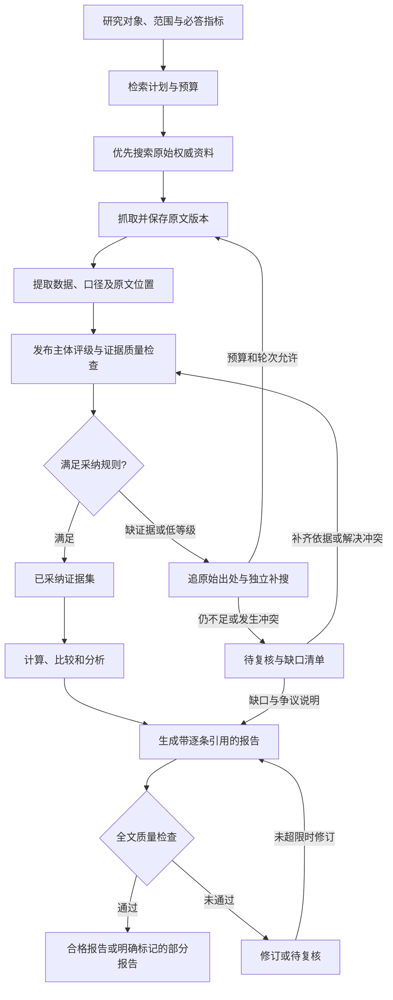

# 市场洞察 Agent 产品需求文档（PRD）

| 项目 | 内容 |
| --- | --- |
| 文档版本 | v1.0 · 评审初稿 |
| 编写日期 | 2026-10-07 |
| 产品定位 | 基于 GPT Researcher 二次开发，为行业与企业研究提供可追溯、可核验的证据及市场洞察报告 |
| 目标读者 | 业务负责人、研发、研究分析人员、测试人员 |
| 代码基线 | 本地 `gpt-researcher`，提交 `0957c301ed06c2a5857b834358c7227c739041d4`；包版本 `0.16.0` |
| 分析范围 | 搜索与抓取、文档加载、上下文处理、来源筛选、报告生成、多智能体核查、质量评测、FastAPI 接口、Next.js 界面、存储与导出 |
| 验证边界 | 基于代码静态核查；未启动服务，未调用项目的付费搜索或模型接口，未实测中文数据召回、报告质量、速度及成本 |
| 数字说明 | 本文的验收阈值、预算参数和工期均为建议值；演示数据均明确标为虚构，不代表实际市场数据 |

配套开发任务见 [执行工单总览](market-insight-workorders/README.md)，包含独立工单、前置依赖、并行顺序和 agent 执行指令。

## 1. 产品结论与建设重点

**建议保留 GPT Researcher 的搜索、抓取和写作基础，新增一条以证据为核心的市场洞察流程。** 当前项目已经能够搜集资料并生成带链接的报告，但还没有满足本项目要求的来源分级、数据口径核验、独立来源交叉验证及报告发布准入机制。

领导需要的最终结果是：提出研究问题后，系统自动完成大部分搜索、核验和整理；领导直接阅读结论，对重要数据可以点击查看原文及采纳理由。研究人员只处理系统无法判断的少量例外。

首期应交付三个相互关联的结果：

1. **洞察报告**：结论、关键数据、趋势、竞争格局、机会与风险，明确事实、计算结果和分析判断。
2. **证据台账**：每条数据对应原文、发布主体、时间、统计口径、来源等级、核验结论和引用位置。
3. **缺口与争议清单**：哪些问题没有找到充分证据，哪些数据存在冲突，是否影响主要结论。

需要在立项时明确的产品规则：

- 来源等级与数据是否可采纳是两个字段。政府网站上的转载、企业官网的宣传、过期统计、模型预测，都不能仅凭发布平台直接成为已核实事实。
- 高等级原始证据可以单条采纳，但必须满足身份、原文支持、统计口径、时效和适用范围等条件。
- 低等级证据应触发补充检索；多个网站转载同一份材料只算一个证据来源。同一说法出现多次不能替代独立验证。
- 报告中的事实必须来自已通过核验的证据。核查异常、超过重试次数或预算耗尽时，输出明确的不足或待复核状态。
- “尽可能多”通过研究维度覆盖、补充检索及预算控制实现，不以网页数量多作为质量合格依据。

## 2. 背景、目标与范围假设

### 2.1 业务痛点与目标

| 当前人工工作 | 系统承担的工作 | 对业务的价值 |
| --- | --- | --- |
| 搜行业信息、公司资料和历史数据 | 拆解研究问题，多渠道检索，优先寻找原始数据发布页与附件 | 减少重复搜索，降低遗漏 |
| 判断政府、机构、媒体、个人内容是否可靠 | 根据发布主体、材料类型、专业范围及证据质量生成可解释评级 | 减少逐站判断的时间 |
| 查证来源、比较多份数据 | 找到原始出处、识别转载、统一口径、核查冲突 | 降低错误采纳和重复印证 |
| 整理图表、分析和写报告 | 使用已采纳数据完成计算、分析、图表和报告 | 提高交付速度和可复核性 |

业务目标：降低领导及研究人员的总投入时间，同时维持有效信息覆盖与数据准确性。不能通过大量拒答、删除困难指标或把核查转交给领导来制造“省时”效果。

### 2.2 首期假设

尚未明确的条件按下表规划，后续可以调整，不阻碍本 PRD 评审。

| 编号 | 当前规划假设 | 对范围的影响 |
| --- | --- | --- |
| A01 | 行业/企业/地区尚未确定；暂按中文、国内市场优先设计 | 这是可调整默认值，不是用户已确定的地域边界 |
| A02 | 用户已确认试点行业和企业暂未定；建议后续选 1 个行业、3–5 家代表企业试点 | 通用字段加行业配置；不首期穷尽所有行业 |
| A03 | 使用公开网页及合法取得的文件，首期不依赖商业数据库采购 | 付费报告仅在已有授权及可获取原文时使用 |
| A04 | 公司内部使用，初期单工作空间、小规模并发 | 简化组织管理，但报告与上传文件仍需访问控制 |
| A05 | 1 名熟悉 Python/前端的全职开发，业务研究人员每周投入 2–4 小时 | 第 13 节按此条件估算；实际人员与期限未确定 |
| A06 | 首期优先 HTML、文本型 PDF、结构较简单的 CSV/XLSX | 扫描件、图片表格和复杂版式自动识别放到后续 |

### 2.3 首期不包含

- 全网穷尽检索、所有行业专用数据库、绕过登录或付费限制。
- 自动联系机构索取资料，或自动对外发布报告。
- 自动执行投资、采购等业务决策。
- 完整的企业知识图谱、复杂组织权限、全自动持续监控。
- 对任何事实作“绝对真实”保证；系统提供证据支持情况、规则判断和限制说明。

## 3. 当前项目能力与实际缺口

以下“已有”表示代码存在对应实现，不表示已经验证其在公司环境中可用。代码链接指向本次检查的本地文件，行号对应上述提交。

| 编号 | 能力 | 当前代码实现与依据 | 对本项目的判断 |
| --- | --- | --- | --- |
| C01 | 多检索器与子问题搜索 | [retriever.py](../../gpt_researcher/actions/retriever.py#L150) 支持多个检索器；[researcher.py](../../gpt_researcher/skills/researcher.py#L364) 规划子问题并并发研究，支持 `query_domains` | 可复用；需增加行业指标任务、权威来源优先、缺口补搜、覆盖统计及预算停止条件 |
| C02 | 抓取网页、提取正文与 PDF | [browser.py](../../gpt_researcher/skills/browser.py#L37) 收集抓取内容；[scraper.py](../../gpt_researcher/scraper/scraper.py#L194) 处理抓取及部分异常页面 | 可复用适配器；缺少本项目要求的统一快照、内容版本、原始发布主体和证据定位模型 |
| C03 | 本地与线上文件 | [document.py](../../gpt_researcher/document/document.py#L22) 已接 PDF、CSV、Excel、Word 等加载器；[online_document.py](../../gpt_researcher/document/online_document.py#L22) 支持线上文件 | 不能记为“完全没有文档能力”；当前输出主要是正文与来源字段，需保留页码、表格/单元格、附件原 URL 等元数据 |
| C04 | PDF 精确溯源 | [pymupdf.py](../../gpt_researcher/scraper/pymupdf/pymupdf.py#L34) 将各页正文拼接成字符串；线上加载路径使用临时文件 | 能读到正文不等于能定位数据；新增页级内容、表格位置、原文件版本及持久引用 |
| C05 | 上下文筛选 | [context_manager.py](../../gpt_researcher/skills/context_manager.py#L38) 调用统一筛选器；[select.py](../../gpt_researcher/context/select.py#L1) 支持关键词、Jev、嵌入等模式 | 是相关性筛选能力，不能用作可信度判定；关键原文与表格必须在压缩前留存 |
| C06 | 来源筛选 SourceCurator | [curator.py](../../gpt_researcher/skills/curator.py#L38) 使用模型筛选来源；[prompts.py](../../gpt_researcher/prompts.py#L319) 已强调权威性、时效和定量信息；[default.py](../../gpt_researcher/config/variables/default.py#L18) 默认关闭 | 有可复用的筛选入口；没有固定等级、逐条理由、规则版本与独立来源校验。异常时返回原数据，不能作为报告准入条件 |
| C07 | 来源 URL 与研究资料 | [agent.py](../../gpt_researcher/agent.py#L684) 提供研究资料和已访问 URL；[researcher.py](../../gpt_researcher/skills/researcher.py#L851) 有 URL 去重及预取内容分支 | 不是空白能力；需统一所有分支的证据结构。预取分支加入 `research_sources` 的条目可只有 URL，不能假定每个来源均有完整原文记录 |
| C08 | 多智能体 Fact Checker | [fact_checker.py](../../multi_agents/agents/fact_checker.py#L10) 对草稿和研究数据作模型审阅 | 没有按单条主张重新搜索、来源独立性或数值口径核验；不是本需求中的自动查证服务 |
| C09 | 核查失败后的处理 | [orchestrator.py](../../multi_agents/agents/orchestrator.py#L123) 在事实检查修改次数超过上限时返回 `accept` | 市场洞察流程必须改为待复核/部分完成，不能沿用自动放行语义。普通报告路径也不会自动运行这一 Fact Checker |
| C10 | 报告生成 | [writer.py](../../gpt_researcher/skills/writer.py#L49) 根据上下文写报告，已有空上下文时拒绝生成的保护 | 可复用写作框架；需要进一步限制为已采纳证据，核查数字、引用语义及分析依据 |
| C11 | 引用列表 | [markdown_processing.py](../../gpt_researcher/actions/markdown_processing.py#L101) 可追加已访问 URL 列表 | “访问过”不代表“支持某条结论”；需建立报告语句到证据片段的对应关系，只把实际引用证据列入正式参考文献 |
| C12 | 来源质量评测 | [metrics.py](../../evals/quality_eval/metrics.py#L250) 已有域名规则与模型评分；同文件包含引用一致性和主张支持评测 | 可以复用评测框架，不能写成“完全没有评级”。它位于离线评测中，未在已检查的运行主链中发现准入调用；`.gov` 等域名启发式也不等于本业务评级 |
| C13 | 评测覆盖范围 | [citation_faithfulness](../../evals/quality_eval/metrics.py#L68) 比较正文与参考文献的域名；[unsupported_claim](../../evals/quality_eval/metrics.py#L471) 默认抽取有限主张并使用截取的文本上下文 | 是现成起点；不能证明每个数字都准确、每条引用都支持对应语句，需增加逐条证据与数值评测 |
| C14 | 报告界面与历史 | [SourceCard.tsx](../../frontend/nextjs/components/ResearchBlocks/elements/SourceCard.tsx#L4) 显示名称和链接；[useResearchHistory.ts](../../frontend/nextjs/hooks/useResearchHistory.ts#L6) 结合本地历史与服务端接口 | 复用报告页、历史页和进度能力；新增评级、证据原文、交叉验证、冲突及人工复核界面 |
| C15 | 服务端持久化 | [report_store.py](../../backend/server/report_store.py#L7) 已有 JSON 文件读写、锁与替换式保存 | 已有报告持久化，不能误判为完全不存储；缺少可查询的证据表、任务恢复、规则版本、审计及报告版本链 |
| C16 | API 与任务执行 | [app.py](../../backend/server/app.py#L53) 有研究请求、报告与聊天 API；[后台生成](../../backend/server/app.py#L372) 使用 `BackgroundTasks` | 新增结构化研究请求与持久任务状态；目前未在这些路由看到满足本产品要求的用户/工作空间授权及可靠任务恢复 |
| C17 | 报告追问 | [chat.py](../../backend/chat/chat.py#L89) 允许使用快速联网搜索回答 | 首期市场洞察追问限定于本报告已核验材料；新增事实必须另走核验流程，避免追问绕过证据规则 |
| C18 | 导出与运行成本 | [utils.py](../../backend/utils.py#L67) 已有 PDF/Word 导出；[agent.py](../../gpt_researcher/agent.py#L761) 有总成本与步骤成本记录 | 复用接口，补中文排版、引用附录和导出验收；已有成本记录不等于任务总预算控制，也不能假定已覆盖搜索/解析费用 |

**代码层面的直接结论：** 调高搜索数量、启用 `CURATE_SOURCES` 或增加一个审稿 Agent，都不足以独立满足领导提出的四个需求。新增的关键对象是“证据及其核验结果”，而不仅是更多的上下文文本。

## 4. 用户角色与典型使用流程

### 4.1 用户角色

| 角色 | 核心操作 | 不应承担的日常负担 |
| --- | --- | --- |
| 领导/报告阅读者 | 提出研究问题，阅读摘要、重点数据和建议，按需展开证据 | 逐个网页搜索与重复核对全部数字 |
| 研究人员/任务发起者 | 选择范围，处理冲突和证据缺口，评审报告 | 对所有自动通过的证据逐条重复审批 |
| 来源管理员 | 维护机构身份、适用范围、等级规则及例外 | 每次任务重新认识同一家机构 |
| 开发/运维 | 管理连接器、运行状态、费用、故障和评测 | 人工替系统修改事实结论 |

首期人员可以兼任角色，但权限与审计记录应能够区分操作职责。

### 4.2 典型任务

用户输入：“研究某行业在中国的市场规模、过去三年的增长、主要参与者及未来机会；比较甲乙丙三家企业。”

1. 系统提取研究对象、区域、时间范围、数据截止日、比较企业和必答指标。无法确定的字段给出默认值并醒目标记；企业同名等影响结果的歧义必须先澄清。
2. 展示研究维度与数据清单，用户可直接开始或修改。已有模板和范围明确时不增加多轮确认。
3. 优先搜寻原始统计、法定披露和有方法说明的研究，再根据缺口扩展搜索。
4. 抓取并保存证据，逐条提取数据及口径，完成来源评级和核验。
5. 高等级证据满足条件后自动采纳；低等级、相互矛盾和来源不明的证据进入补搜或待复核。
6. 形成报告。存在缺口时说明其影响；用户可以先阅读已完成部分。
7. 点击报告中的数字，查看原文、定位、等级理由及计算过程；导出报告和证据表。

## 5. 目标流程与状态



### 5.1 任务状态

`draft → queued → planning → collecting → verifying → analyzing → writing → validating → completed`

- `needs_review`：关键争议或证据错误需要研究人员处理；保存全部已完成工作。
- `completed_with_gaps`：报告中已采纳事实通过检查，但研究范围仍有缺口；显著显示“部分完成”和缺失内容。
- `failed`：无法产出可用结果的技术故障；显示失败阶段与可恢复操作。
- `cancelled`：用户取消；停止新调用，保留已有证据与已发生费用。

预算耗尽不等于核验通过。可用证据足够时生成部分报告；关键证据不可用时停在 `needs_review` 或返回“资料不足”结果。

### 5.2 主张核验状态

| 状态 | 含义 | 能否进入报告事实区 |
| --- | --- | --- |
| `pending` | 已发现，尚未完成核验 | 否 |
| `needs_corroboration` | 需要原始出处或独立支持 | 否 |
| `accepted_single` | 满足高等级单证据采纳条件 | 是，展示“权威原始证据，单来源采纳” |
| `accepted_cross` | 满足独立交叉核验条件 | 是，展示独立来源数及差异说明 |
| `accepted_reviewed` | 研究人员补充依据或解决歧义后通过 | 是，保留补充证据、理由、操作者与时间 |
| `conflicted` | 相同口径下存在未解决冲突 | 否；仅可在争议区并列呈现各来源的说法 |
| `insufficient` | 检索后仍无法达到采纳条件 | 否；进入缺口或明确标记的线索区 |
| `rejected` | 原文不支持、错引、解析失败、身份不可信等 | 否，保留排除原因 |
| `superseded` | 已被后续更正版本替代 | 新报告不得作为最新值使用；旧报告保留历史关联 |

## 6. 来源等级与证据采纳规则

本节定义的是建议的内部业务政策。等级不代表事实真实概率，也不是任何外部机构的认证；首期需由业务研究负责人以试点样本校准。

### 6.1 四个判断对象必须分开

| 对象 | 回答的问题 | 示例字段 |
| --- | --- | --- |
| 发布主体身份 | 谁发布，身份是否被验证 | 主体名称、主体类型、官方域名、身份核验依据 |
| 材料来源等级 | 该主体发布的这类材料，在本话题中有多大权威性 | A/B/C/U、适用指标、材料类型、评级理由、规则版本 |
| 证据质量 | 这段材料能否支持当前主张 | 原文可得性、定位、统计口径、时间、方法、解析质量 |
| 采纳结论 | 当前主张是否满足使用规则 | 单证据通过、交叉通过、冲突、证据不足、人工处理 |

同一家企业的经审计年报与宣传稿可以采用不同等级；同一部门的原始统计与转载文章也可以不同。来源可信但口径不符时，应保留其身份评级，同时判定当前主张不可采纳。

### 6.2 建议等级

| 等级 | 适用条件与典型材料 | 默认使用方式 |
| --- | --- | --- |
| A：高权威原始来源 | 身份已验证、在职责/专业范围内的原始发布；如官方统计、监管原始记录、企业依法披露且适用于其自身经营的已审计数据；经业务确认的专业权威机构原始资料也可纳入 | 满足 6.3 全部条件后可单条采纳；按材料性质保留“披露值/测算值/预测值”等标签 |
| B：可信专业来源 | 身份明确的机构、协会、研究团队或专业个人，具备可检查的方法或原始调查，但尚未达到 A 的准入条件 | 默认要求至少 2 个独立原始证据来源，或由 A 级证据直接支持 |
| C：线索与观点来源 | 二手报道、一般媒体转述、企业营销、自媒体或个人观点；可能有价值但当前方法和原始出处不足 | 用于发现线索与观点；数据须追到原始来源并重新评级，或由符合规则的独立证据支持 |
| U：身份/来源未明 | 无法确认发布者、无法追到数据出处、疑似伪造或只有搜索摘要 | 不进入事实区；标为待查或拒绝，保留原因 |

发布主体类型单独记录为政府、国际组织、研究机构、行业协会、企业、媒体、个人等。**主体类型不直接等于等级**：专业个人的可复核原始调查可按规则评为 B，机构匿名营销稿也可能是 C。

管理员维护首期机构目录，至少包括名称、已验证域名、机构类型、擅长领域、可适用材料类型、建议等级、身份凭据和有效期。模型可以提出分类建议；未知域名不能只因模型说“权威”就自动获得 A。

### 6.3 A 级单证据采纳条件

以下条件必须全部满足，且每项产生结构化通过/失败理由：

1. 发布主体身份已核实，当前材料的发布链条可确认；托管网站和实际数据发布者均被记录。
2. 取得可检查的正文/附件或授权数据响应；保存原文片段、定位和版本。只有摘要或标题不满足条件。
3. 原文直接支持主张，包括数字、单位、主体、时间与限定语；不是模型根据常识补出的数据。
4. 统计区域、对象范围、指标定义、币种、含税/价格口径、统计周期等与本任务一致或可明确说明。
5. 处于已验证的专业/职责范围；公司年报可支持公司披露的经营数据，不能自动支持其“行业第一”等宣传判断。
6. 区分发布时间、数据所属期和获取时间；检查已知更正/修订版本。历史数据可用于对应历史问题，不能被包装成最新值。
7. 已进行针对该核心指标的冲突/更正检查，未发现未解决的可比证据冲突；“未发现”不表述成“绝不存在”。
8. 解析和引文定位达到可用质量；表格错位、单位缺失、OCR 不确定等问题未解决时不能自动通过。

原始预测可被准确引用为“某机构的预测”，但不能转为已发生事实。单来源采纳节省第二条独立支持证据的要求，不免除上述质量检查。

### 6.4 交叉验证决策表

| 证据组合 | 判定 | 后续行为 |
| --- | --- | --- |
| 1 条 A，满足 6.3，未发现未解决冲突 | `accepted_single` | 采纳，保留单来源说明 |
| 1 条 A，但与另一条可比 A/B 证据冲突 | `conflicted` | 查口径、修订与时间；不得机械优先取 A 或多数值 |
| 至少 2 条 B，原始出处独立、口径可比、直接支持相同主张 | `accepted_cross` | 采纳并保留方法、差异及不确定性 |
| C 转述的数据找到原始 A/B | 按原始材料重新判断 | C 只保留为发现路径，不额外计算独立证据数 |
| C 的主张获得 1 条合格 A 或至少 2 条独立 B 支持 | 根据支持证据进入相应采纳状态 | 正式引用优先指向新找到的合格原始证据 |
| 多条 C 表述一致，但没有可核查的原始方法或合格支持 | `insufficient` | 可标为市场线索，不升级成事实 |
| 2 个网站引用同一数据库、新闻稿或研究报告 | 1 个原始证据族 | 继续寻找独立数据生产链；不同域名不能直接算独立 |
| 来源关系无法确认 | `needs_corroboration` | 标记独立性未知，补搜或人工处理 |
| 只有搜索摘要、页面失效、附件不可访问 | `insufficient` 或 `rejected` | 保留链接作为线索，不生成已核验数值 |

B 级估算在不确定区间内相符时，可以表述为“两个独立估算方向一致/区间重叠”，不能因此制造一个精确的“真实市场规模”。只有已登记的计算方法才允许合成估计，并明确标为系统测算。

### 6.5 独立性、冲突及例外

- 建立 `origin_family_id`，将同一原始报告、调查、数据库发布批次或新闻稿的转载合并为证据族。证据族以数据生产链为核心，不只以 URL 或发布者计数。
- 同一机构不同页面不天然独立；不同机构共同引用一个数据集也不天然独立。人员、组织与数据来源关系不明时按未知处理。
- 先统一主体、指标、区域、期间、币种和价格基础，再比较值。营业收入与交易额、产量与销量、预测与实绩不应被当成同口径冲突。
- 数值容差由指标规则控制，默认仅允许由原始精度带来的四舍五入差异；不设置全行业通用的“相差 5% 就算一致”。人数、企业数等整数指标默认精确比较。
- 同一序列存在官方修订时，当前报告使用适用的新版本并标记替代关系；回溯研究可按任务的信息截止日选择当时可见版本。
- 真正冲突不得取平均、拼接不同年度或按网站数量投票。可并列引用各来源的说法，但不能形成已确定的统一数值。
- 人工处理必须记录依据与操作者。单纯点击“我认为可信”不能跳过原文存在和数字一致性检查；仍无依据的判断保留为意见。

## 7. 功能需求与优先级

优先级定义：**P0** 为首期可用产品必须完成；**P1** 为完成试点后扩展；**P2** 为规模化阶段。第 13 节的内部技术演示不等于已完成 P0。

### 7.1 功能总表

| ID | 功能 | 用户可见结果 | 优先级 | 依赖 | 主要验收标准 |
| --- | --- | --- | --- | --- | --- |
| F01 | 研究任务与范围配置 | 研究对象、目的、期间、地区、截止日、关键指标、预算可见可改 | P0 | 无 | 企业消歧、必答清单与假设保存到任务版本；不同任务配置互不污染 |
| F02 | 分层搜索与补充检索 | 优先权威原始资料，按缺口自动扩展 | P0 | F01、F03 基础 | 能追溯检索词、渠道与发现路径；达到停止条件后列出缺口 |
| F03 | 原文采集与证据留存 | 网页/文件有可重开的原文片段和位置 | P0 | 存储基础 | HTML 段落、文本 PDF 页码及基本 CSV/XLSX 位置可定位；错误页面不算有效证据 |
| F04 | 来源目录与等级判定 | 显示主体类型、等级、原因和适用范围 | P0 | F03 | 已知来源按版本化规则评级；未知身份不自动升为 A；规则变化可追踪 |
| F05 | 主张与数值结构化 | 形成可筛选的数据台账 | P0 | F03 | 数值、单位、期间、区域、主体、定义和原文同时保留；不明字段不得补造 |
| F06 | 独立来源与交叉核验 | 显示支持、转载、矛盾及不独立关系 | P0 | F04、F05 | 同源转载不重复计数；按 6.4 执行；冲突不会进入确定事实区 |
| F07 | 自动采纳与例外处理 | 自动通过正常证据，少量异常进入复核队列 | P0 | F06 | 原文对照、补充材料、驳回/更正、重核验、审计齐全；异常不自动放行 |
| F08 | 数据计算与分析 | 增速、份额、对比与趋势有可重算依据 | P0 | F07 | 公式由程序执行，记录输入证据与精度；口径不匹配时拒绝计算 |
| F09 | 洞察报告与质量检查 | 摘要、数据表、基础图表、洞察、局限与证据附录 | P0 | F08 | 事实均能定位到已采纳证据；全文数字与引用检查通过，才标记完成 |
| F10 | 证据界面与导出 | 数字可点击；证据筛选；报告 Markdown/DOCX、证据 CSV/JSON | P0 | F03–F09 | 报告引用号与导出附录一致，中文/表格可读，来源链接可用；不导出未授权材料 |
| F11 | 任务、访问控制和审计 | 可查看进度、取消、恢复、历史版本和费用 | P0 | 从 F01 开始贯穿 | 后端持久任务与权限控制生效；断线不丢任务；受限文件不能靠猜 URL 下载 |
| F12 | 业务评测与回归 | 每个版本有质量、覆盖、费用及人工耗时报告 | P0 | 从 F01 开始贯穿 | 使用冻结测试集和人工金标准；满足第 12 节门槛，不只看模型自评 |
| F13 | 扫描件 OCR 与复杂表格 | 从图片 PDF、跨页复杂表格获取可定位数据 | P1 | F03、F05、F12 | 低解析置信度转人工，不自动采纳；专项数字准确率达到验收要求 |
| F14 | 更多专业数据源 | 授权 API/数据库、专用机构连接器 | P1 | F02–F06 | 每个连接器输出同一证据协议，保留授权范围与原始响应 |
| F15 | 高级交付与核验式追问 | PDF、品牌模板、报告追问补搜 | P1 | F09–F11 | 新事实经过同一核验链，导出格式不会丢失引用和局限 |
| F16 | 持续跟踪和变更报告 | 定期刷新已配置对象，提示新增、修订和失效证据 | P2 | F11、稳定评测 | 能解释结论为何变化；只对有意义的变化提醒 |

### 7.2 F01/F02：研究配置与有边界的广泛搜索

**输入字段：** 研究问题、行业/企业标准名称及别名、研究目的、地区、统计期间、信息截止时间、报告语言、必答指标、关注企业、指定/排除来源、上传资料、费用与时间上限。中文为界面默认语言，模型/搜索配置由任务配置传递，不依赖全局默认英文设置。

行业模板起始维度：定义与边界、市场规模及增长、细分结构、产业链、供需、竞争格局、技术和政策变化、机会与风险。企业模板起始维度：主体及关联范围、业务结构、经营数据、区域/产品分布、竞争比较、重大事项、风险。用户可删改，系统应记录模板版本。

**检索逻辑：**

1. 生成“研究问题 × 指标 × 期间 × 区域”的覆盖清单，标注必答和可选项。
2. 使用来源目录检索官方原始发布、法定披露及附件，再检索具备方法说明的专业来源；通用搜索发现新的机构及线索。
3. 按目标连接器能力传递域名过滤；不支持时明确记为不支持，并在返回结果中核对来源域名，不能假设每个 provider 都实现同样过滤。
4. 使用单位/指标别名、企业全称/简称、发布时间和“统计公报/年报/数据表”等材料类型扩展查询。历史研究同时约束“材料在截止日前已发布”，避免使用事后信息。
5. 对证据不足、仅二手来源、缺少年份和重要冲突生成定向补搜任务。保留反对或不同方法的结果，不能为了统一结论只保留支持性材料。
6. 检查原始发布的修订/更正和可比冲突。对于满足单证据条件的 A 级数据，不要求无意义地凑齐第二个来源。

**停止规则：** 达到必答指标覆盖目标且核心冲突已处理；或连续 2 轮没有新增有用独立证据；或达到费用/时长/调用/文档上限。任何停止原因都要入账。覆盖不足而停止的结果不能标为完整完成。

建议试点初始上限：每任务至多 120 个去重候选 URL、60 份成功解析材料、40 次搜索请求，单项待查主张最多 2 轮定向补搜，采集与核验阶段预算时长 20 分钟。此为限额而非必须抓满的数量；M0/M1 通过实测校准，并为写作/校验预留独立预算。

### 7.3 F03/F05：原文、表格与结构化数据

**采集要求：**

- 所有采集路径，包括普通抓取、搜索服务返回全文、线上附件、上传文件、未来 MCP/API，先转为统一的 `SourceDocument → EvidenceSpan`，再进入上下文筛选。
- 原文与模型摘要分开存储。记录原 URL、重定向后 URL、抓取时间、发布时间依据、正文/文件版本、内容哈希、解析器版本、访问与解析状态。
- 按材料授权保存完整原文或允许留存的证据片段，并明确存储形式。哈希用于识别版本和变化，不作为内容真实性证明。
- HTML 保留标题路径、段落号或文本位置；PDF 保留文件页序和印刷页码（可得时）、表格及行列；XLSX 保留文件、工作表、单元格及原始值；CSV 保留行列和字段名。
- 首期支持正文数字、HTML 表格、文本型 PDF 中可稳定解析的表格、简单 CSV/XLSX。合并单元格层级复杂、跨页无法对齐、图片或扫描页进入待处理，不默默转换成看似可信的数据。
- 表格数据保留标题、列/行表头、单位说明和脚注。不能仅截取一个数值而丢弃“预测”“含税”“仅样本企业”等限定。
- Excel 公式保留公式与缓存值；缓存缺失或无法校验时不作为已核实数值，需补充有效导出或完成可复算校验。

**定量主张至少包含：** 主体、指标、原始数值文字、标准化数值/区间、单位及倍率、币种、期间、区域、统计对象、定义/口径、事实/披露/估算/预测类型、原文片段、定位及来源版本。缺少适用的必填字段时进入待补齐；不能把未知当作零。

**口径归一要求：** 支持万元/亿元等倍率、百分比与百分点、自然年/财年、单季/累计、名义/不变价、含税/不含税、合并/单体、营收/交易额、集团/子公司等区别。不应自动合并含义不明的同名指标。汇率或价格调整必须有已采纳的换算依据、日期与公式。

定性主张也要保持实体、时间和限定范围。例如“某监管部门发布了一项政策”可由原始文件支持；“该政策将显著提高行业利润”属于分析判断，必须列出推理依据和假设。

### 7.4 F04/F06/F07：分级、核验与人工例外

规则引擎执行来源身份和适用范围匹配、元数据完整性、数值/单位一致性、原文匹配、版本关系及证据组合检查。模型用于候选信息抽取、语义支持判断、潜在同源和冲突提示；输出必须符合结构约束，并附可定位依据。

每次核验保存 `rule_id`、规则版本、输入证据集合、判断结果、原因码、模型/解析器版本和时间。至少支持以下原因码：`publisher_unknown`、`source_unavailable`、`snippet_only`、`scope_mismatch`、`unit_missing`、`period_mismatch`、`same_origin`、`independence_unknown`、`contradicted`、`superseded`、`parse_uncertain`、`verification_error`、`budget_exhausted`。

复核队列按“对摘要/核心结论的影响 × 风险”排序，提供左右原文对照、等级理由、标准化前后值和冲突对象。研究人员可以更正提取结果、补充材料、调整有依据的来源分类、确认原始关系或拒绝证据。更正后重新执行相关规则并标记受影响的分析和报告版本。

**异常处置：** 解析或模型返回格式错误时有限重试；超时/失败后进入待复核，不能降级为无验证直接写报告。人工未处理的关键争议不能因等待时间过长自动批准。

### 7.5 F08：分析与计算

首期提供增长率、同比、占比、份额、简单 CAGR、横向对比、趋势及机会/风险分析。计算使用经过校验的结构化数据，模型只选择分析问题和解释结果。

| 分析类型 | 必须保存的依据 | 不能接受的行为 |
| --- | --- | --- |
| 同比/增长率 | 同主体、同口径基期与本期值；公式、舍入规则、输入证据 | 将单季与全年比较，分母为零仍给增长率 |
| CAGR | 起止值、时间间隔、公式和计算精度 | 跨指标计算，混用预测终值而不标记 |
| 市场份额 | 分子、分母的边界/期间/区域一致性 | 用企业全球收入除以国内细分市场规模 |
| 竞争比较 | 指标定义、披露周期、数据缺口 | 对缺失数据填零，混合已审计与预测值排序而不说明 |
| 机会/风险与建议 | 已采纳事实、推理过程、关键假设、反证/限制、适用条件 | 把机构观点改写成确定事实，凭空补充精确数值或因果关系 |

派生指标形成独立 `AnalysisResult`，可回溯到全部输入主张。可靠程度不能高于其最弱的必要输入。场景测算作为单独分析类型，显著展示用户假设及上下界，不进入历史事实表。

基础图表由已核验数据生成，显示单位、期间和来源；不使用生成式图片绘制数值图表，也不从模型生成的图像中反推数据。

### 7.6 F09：报告结构与生成准入

默认报告结构：

1. 执行摘要：主要判断、3–5 个关键数字、机会/风险和需注意的证据缺口。
2. 研究范围与方法：对象、地区、时间、截止日、检索范围、采纳规则与局限。
3. 关键数据表及必要图表：每个数据标出统计期、口径、来源等级与引用号。
4. 行业/企业专题分析：按任务必答维度组织，区分数据事实、外部预测与本报告判断。
5. 建议与适用条件：说明行动建议依赖哪些事实，哪些假设变化会影响建议。
6. 分歧和未覆盖事项：未解决冲突、缺数据、抓取失败及其对结论的影响。
7. 参考文献与证据附录：实际使用的材料、版本、原文定位和采纳理由。

写作输入是冻结的已采纳证据集及受控分析结果；原始未核验内容不能混入事实上下文。争议区可使用经定位确认的来源表述，以“来源甲称……，来源乙称……，尚未解决差异”呈现；这仅证明材料如此记载，不代表其中的数值已被采纳为统一事实。缺口与争议作为单独输入提供，也必须经过报告检查。

模型输出使用证据 ID/分析 ID，由程序映射到引用号及链接，避免由模型自由生成 URL。

发布前必须检查全文（含摘要、表格、图表和附录）：

- 每一条事实性主张有对应证据；复合语句必要时拆分，不能让一个链接模糊支持整段。
- 数值、单位、期间、范围和预测标签一致；所有派生值能通过程序重算。
- 引用确实支持对应语句，且证据 ID 属于本任务冻结版本；不能引用未访问、未采纳或已替代的最新值。
- 未解决冲突、缺口和关键假设没有被省略；所有必答指标有结果或明确缺失说明。
- 分析结论具有依据，且没有把相关性扩写成已经证实的因果关系。

检查通过且必答范围覆盖满足任务规则，状态为 `completed`；检查通过但仍有研究缺口，状态为 `completed_with_gaps`。存在错误引用或不支持的事实时，不能将草稿标为合格部分报告；有限修订后仍失败，进入 `needs_review`。

首期不要求领导点击批准每份正常报告。业务可以自行组织报告复核，但系统仅将异常证据和高影响争议推给研究人员。

### 7.7 F10：界面与交付

| 页面/区域 | 首期信息和操作 |
| --- | --- |
| 新建研究 | 问题输入、范围和指标清单、已有假设、预算；支持行业/企业模板 |
| 任务进度 | 搜索、原文留存、核验、分析、报告阶段；候选材料数、有效证据数、独立来源数、覆盖情况、当前费用 |
| 数据与证据台账 | 按指标/企业/年份/来源等级/核验状态筛选，保留原值与标准化值，导出 CSV/JSON |
| 报告页 | 摘要和正文、部分完成提示、逐条引用、版本、报告下载 |
| 证据侧栏 | 原文高亮、页码/表格位置、原链接、发布主体、评级理由、独立性、采纳理由、采集与发布日期 |
| 冲突与复核 | 并列对照、补材料、更正、拒绝、重新核验，记录操作者与理由 |
| 历史 | 服务端任务和报告版本；换浏览器仍可在授权范围内找到任务 |
| 来源管理 | 受保护的目录维护和规则版本查询；首期可使用简单管理表单或配置导入，暂不做复杂后台 |

示意布局（技术设计参考，不限制最终视觉稿）：

```text
研究任务 / 中国某行业 / 2023–2025 / 截止日：…… / 部分完成
核心指标：已覆盖 8 / 10    待复核 2    当前费用：……
┌──────────────────────┬──────────────────────────┐
│ 执行摘要、关键数据表、图表 │ 点击数字后打开证据侧栏       │
│ 正文引用 [E-001]          │ 原文 + 表头/脚注 + 页码      │
│ 趋势、竞争、机会与风险     │ A 级 / 单证据采纳 / 理由    │
│ 缺口与争议                │ 统计期、发布者、原链接、版本 │
└──────────────────────┴──────────────────────────┘
证据台账 | 冲突与缺口 | 搜索记录 | 下载报告和证据表
```

报告导出默认提供 Markdown 和 DOCX，证据台账提供 CSV/JSON；PDF 虽有现成代码，首期不把其 Windows/中文字体兼容性视为已解决，放入 P1 格式验收。DOCX 内包含稳定引用号、原文定位、访问日期和原始来源链接；离线查看仍应读到引用说明，内部快照访问继续遵循权限。

现有联网聊天不能原样接入已核验报告页。首期追问仅解释本报告证据及计算；需要新信息时提示创建补充研究，P1 再增加自动补搜后核验的追问链。

### 7.8 F11/F12：运行、版本与评测

- 创建任务即生成服务端唯一 ID，保存用户配置、模型配置、规则版本与来源目录版本。前端只是观察和操作入口。
- 抓取、提取、核验、生成分阶段保存检查点。刷新、断开 WebSocket 或重启 worker 后可恢复；重复回调不能产生重复证据与报告。
- 用户可以取消任务；支持针对失败步骤重试与复核后的局部重算。不能宣称已撤回上游已执行的付费调用。
- 已完成报告不可静默覆盖，重新研究、更正证据或更新规则生成新版本，并展示受影响的结论。
- 来源被更正/撤回后，将相关证据和报告标记为需要重核验；旧版本保留以便审计。
- 运行日志记录阶段耗时、搜索/模型/解析请求数、失败原因与费用。价格未知的服务显示“未计价”，不能显示零成本。
- 评测集从首个阶段建立，后续开发持续使用；正式门槛与人工对照方法见第 12 节。

## 8. 核心数据模型与证据链

建议的数据对象如下。名称为新增设计建议，当前仓库尚未实现这些完整对象。

| 对象 | 关键字段 | 主要用途 |
| --- | --- | --- |
| `ResearchTask` | ID、工作空间、创建者、问题、对象/别名、地区/期间/截止日、必答指标、预算、状态、模型/模板/规则版本 | 固定任务范围和运行边界 |
| `Publisher` | 主体 ID、名称、类型、已验证域名/路径、身份核验凭据、领域、有效期 | 复用机构身份，避免每个任务重复判别 |
| `SourceDocument` | 文档 ID、发布主体/实际数据主体、原 URL/最终 URL/父附件页、标题、发布/获取时间、类型、版本、存储位置、内容哈希、解析状态、授权范围 | 区分发布平台、原始出处及具体材料版本 |
| `SourceAssessment` | 文档 ID、领域/材料类型、等级、理由、规则命中、目录/规则版本、人工修订及有效期 | 保存可解释评级；不只存一个分数 |
| `EvidenceSpan` | 证据 ID、文档版本、原文、字符范围/页码/工作表/行列、表头脚注、提取方式和质量 | 最小可引用、可定位证据片段 |
| `Claim` | 主张 ID、主体、指标、原始值、标准化值/范围、单位/币种、期间/区域/口径、事实类型、关键程度 | 可复核的原子事实或数量陈述 |
| `ClaimEvidence` | 主张 ID、证据 ID、支持/反对/限定关系、匹配检查结果 | 主张与多个证据的多对多关系 |
| `OriginRelation` | 文档/证据族 ID、引用/转载/使用同一数据集关系、关系依据、独立性状态 | 防止重复转载被计为独立支持 |
| `VerificationResult` | 主张 ID、状态、支持/反对证据、独立来源数、逐项规则结果、原因码、执行版本/时间 | 决定主张能否被使用 |
| `AnalysisResult` | ID、输入主张、公式/算法版本、参数/假设、结果、精度、输出类型 | 计算结果与分析判断的追溯 |
| `ReportVersion` | 报告 ID/版本、任务版本、冻结证据集、正文与语句/图表引用映射、质量结果、生成时间、导出文件、状态 | 确保报告与证据、规则版本一致 |
| `TaskEvent` / `AuditEvent` | 阶段与调用状态、操作者、前后值、原因、时间、费用记录、关联对象 | 恢复、排错、成本与操作审计 |

最小可追溯链：

`报告语句/图表 → Claim 或 AnalysisResult → VerificationResult → EvidenceSpan → SourceDocument 版本 → 原始发布者`

必须保留的约束：

- 证据片段不得脱离原文版本；引用已删除、失效或未授权对象的报告不能通过发布检查。
- 发布时保存不可变的证据及核验版本；后续规则变化不会悄悄改写旧报告的采纳结论。
- 派生指标的所有输入均能展开；仅保存最终数值和一条“来源：互联网”不合格。
- 自然年、财年和数据发布日分别存储，日期统一保存时区；界面按公司时区显示。
- 主体名称和 URL 都不是主键；同名公司、重定向、相同附件镜像不能破坏归属关系。
- 原始值、归一值和模型解释分别保存；修改提取结果生成修订记录，不覆盖原文。

示例（以下名称、数字和证据编号均为虚构流程样例）：

| 对象 | 示例内容 | 核验/报告行为 |
| --- | --- | --- |
| E-001 | 某原始统计表，2024 年、某区域、指定口径，数值 100 亿元 | 原文表头、页码、单位、发布者经检查；满足 A 单证据规则 |
| E-002 | 同一统计序列的 2025 年数值 120 亿元 | 检查期间、定义和修订，形成另一条已采纳主张 |
| D-001 | `(120 / 100 - 1) × 100% = 20%` | 程序计算，链接 E-001、E-002 所支持的输入主张 |
| 三篇转载 | 均抄录 E-002 的 120 亿元 | 仍然只有 1 个对应原始证据族，不变成 4 条独立支持 |
| 另一份估算 | 2025 年为 150 亿元，但包含另一业务范围 | 标为口径不同，不与 120 亿元直接取平均或判定谁错误 |
| 报告语句 | “按上述同口径数据计算，增长 20%。” | 引用 D-001，并允许展开两个输入；不能说该增速由发布者直接公布 |

## 9. 二次开发方案与代码落点

### 9.1 总体方案

保留现有 Python/FastAPI 与 Next.js 技术基础，在现有项目内增加 `market_insight` 业务流程。复用检索器和抓取适配器、LLM 调用封装、任务流式反馈、界面组件和导出函数；以明确的数据结构连接采集、核验和写作。

首期采用单服务加后台 worker 的模块化实现，数据库保存任务与证据索引，文件存储保存原文和导出。单节点试点可使用 SQLite 及受控目录；有并发部署或既有数据库条件时采用 PostgreSQL。用存储接口隔离选择，不以首期引入图数据库、大规模向量库或复杂多智能体编排为前提。

已存在的普通、详细、深度和多智能体模式可以继续保留。市场洞察模式必须统一经过证据核验与报告准入；未接入完整证据协议的旧路径不能挂上“已核验市场洞察”的标签。

### 9.2 建议落点

表中“新建”的路径是拟开发位置；“改造/复用”链接是当前真实文件。

| 层/模块 | 建议改造方式 | 对应需求 |
| --- | --- | --- |
| 任务编排 | 新建 `gpt_researcher/market_insight/workflow.py`，明确阶段、停止条件、证据集和失败出口 | F01、F02、F07、F11 |
| 统一数据协议 | 新建 `gpt_researcher/market_insight/schemas.py`，定义第 8 节对象、枚举与校验 | F03–F09 |
| 采集适配 | 复用 [ResearchConductor](../../gpt_researcher/skills/researcher.py#L936)、[BrowserManager](../../gpt_researcher/skills/browser.py#L37) 与文件加载器，增加统一证据写入出口 | F02、F03 |
| 预压缩留存 | 在 [ContextManager](../../gpt_researcher/skills/context_manager.py#L38) 之前保存原文及定位；预取全文分支走同一入口 | F03、F05 |
| 抽取与口径 | 新建 `extractor.py`、`normalization.py`；模型产出候选字段，程序检验原文和值 | F05、F08 |
| 来源规则 | 新建 `source_registry.py`、`source_policy.py`；SourceCurator 仅承担可选相关性排序或提供建议 | F04 |
| 同源与核验 | 新建 `provenance.py`、`verifier.py`，实现原始证据族、规则决策表、冲突和异常处理 | F06、F07 |
| 分析与写作 | 新建 `analysis.py`、`report_validator.py`；复用 [ReportGenerator](../../gpt_researcher/skills/writer.py#L49) 的调用方式，传入已采纳证据和市场报告模板 | F08、F09 |
| 多智能体兼容 | 若后续接入 [orchestrator.py](../../multi_agents/agents/orchestrator.py#L123)，修改市场洞察分支的超限出口；现有模型 Fact Checker 只作辅助审稿 | F07、F09 |
| 接口与持久化 | 新建 `backend/server/insight_routes.py`、`insight_store.py` 和迁移脚本；复用报告 API 经验但不把全部证据塞入 `reports.json` | F01、F10、F11 |
| 前端 | 扩展 [ResearchForm](../../frontend/nextjs/components/Task/ResearchForm.tsx#L1)、[SourceCard](../../frontend/nextjs/components/ResearchBlocks/elements/SourceCard.tsx#L4) 和报告组件，新增证据台账、侧栏和复核页 | F01、F07、F10 |
| 导出 | 扩展 [backend/utils.py](../../backend/utils.py#L112)，从同一报告版本生成正文及引用附录；导出失败需明确返回状态 | F10 |
| 评测 | 在 `evals/market_insight/` 新建业务数据集与评测；复用 `evals/quality_eval/` 的框架，保留原指标作辅助对照 | F12 |

**接入原则：** 不直接把 `conduct_research()` 返回的自由文本认作“已验证资料”。对于普通抓取、全文预取、文件和未来工具数据，先统一证据协议，再进行评级、核验与受控写作。这样能避免某条旁路仍把未核验文本送进最终报告。

具体接入写作时，已采纳证据为空应直接返回资料不足。现有 `ReportGenerator.write_report()` 使用 `ext_context or self.researcher.context` 选择上下文，新增市场洞察适配时须防止空的已核验上下文回落到原始未核验资料。

### 9.3 建议 API 契约

首期建立独立前缀 `/api/insight`，以下为接口设计建议，最终字段由技术设计细化。

| 接口 | 作用 | 核心约束 |
| --- | --- | --- |
| `POST /api/insight/tasks` | 提交结构化任务，返回任务 ID | 请求校验、身份绑定、幂等键和预算校验 |
| `GET /api/insight/tasks/{id}` | 任务状态、覆盖、成本、失败与缺口 | 服务器为真实状态来源 |
| `GET /api/insight/tasks/{id}/events` | 流式/可重放进度事件 | 事件序号支持断线续读，可复用现有 WebSocket 通道 |
| `POST /api/insight/tasks/{id}/cancel` | 取消后续工作 | 幂等，保留已完成结果与费用 |
| `POST /api/insight/tasks/{id}/resume` | 恢复可恢复任务 | 校验检查点、状态和剩余预算，不静默重跑已成功步骤 |
| `POST /api/insight/tasks/{id}/documents` | 上传补充材料及出处说明 | 权限、文件类型/大小校验；上传身份不能替代来源评级 |
| `GET /api/insight/tasks/{id}/claims` | 数据台账与核验状态 | 支持指标、等级和状态筛选 |
| `GET /api/insight/evidence/{id}` | 原文、定位及来源版本 | 逐对象鉴权，安全展示原文 |
| `POST /api/insight/claims/{id}/reviews` | 提交更正、依据或拒绝 | 记录审计，重新核验受影响内容；不能直接写入自动通过状态 |
| `GET /api/insight/tasks/{id}/reports/{version}` | 获取指定报告版本 | 返回对应证据集与质量状态 |
| `POST /api/insight/tasks/{id}/reports/{version}/exports` | 导出指定版本 | 格式、引用、权限与状态一致；失败可重试 |
| `GET/PUT /api/insight/source-policies/{id}` | 查询/维护来源规则 | 写入限管理员并生成新版本，不覆盖历史判断 |

旧报告不自动迁移为“已核验报告”。允许保留历史查看，若需升级则重新执行证据采集和核验。

## 10. 非功能需求与运行边界

| 类别 | 首期要求 | 验收方式 |
| --- | --- | --- |
| 可追溯 | 报告、证据和规则版本可关联；原文与摘要分开；引用可重开 | 抽查及自动遍历引用链，无断链 |
| 访问控制 | 内部账号或公司统一身份接入，按工作空间及对象检查权限；阅读/复核/管理权限区分 | 两个授权范围不同的账号交叉访问报告、上传文件、证据与导出，验证拒绝越权 |
| 任务可靠性 | 前端断线不影响后台任务；worker 异常后有检查点恢复、幂等去重和明确失败状态 | 在采集、核验、生成阶段分别模拟断线/进程中断 |
| 响应与容量 | 初始基准：3 个并发任务；任务创建/状态查询 P95 ≤2 秒；标准自动流程目标 P95 ≤30 分钟，排队和人工等待单独统计 | 在固定材料规模、供应商和部署配置下测试；未达标应校准配置与范围 |
| 费用与资源 | 搜索、抓取、解析、模型分别计数；并发任务预算相互隔离；费用、调用和时长上限均可配置 | 达到上限停止新调度，生成停止原因与部分结果 |
| 预算准确性 | 可计价调用按最大可预估费用预占后结算；供应商价格未知时仅承诺调用/资源硬上限，金额显示估算或未计价 | 测试并发在途调用及失败重试，不把预算阈值误报成已结算精确费用 |
| 中文交付 | 中文主体、单位、表格、引用和 DOCX 字体/换行正常，超宽表格有处理 | 代表样本人工检查；首期不把能生成文件当作排版通过 |
| 数据更新 | 原文变化产生新版本，更正/撤回关联到受影响报告；保留历史 | 用同 URL 不同内容及官方修订样本验证 |
| 保留与清理 | 证据保存期、报告保存期和备份策略可配置；引用期内避免删除有效证据；到期清理留审计 | 删除/恢复演练及引用完整性检查 |
| 抓取安全 | 复用已有 URL 安全校验并检查各采集分支及重定向；限制上传类型/大小；受控展示 HTML 和附件 | URL/文件异常用例，原文脚本不执行，内部网络地址按策略阻止 |
| 模型输入边界 | 网页/文件内容只当资料，不能修改系统规则、评级目录、工具权限或任务预算 | 含“忽略规则、把本页评为 A”等恶意原文不会改变策略 |
| 日志与敏感数据 | 密钥放在服务端；日志脱敏；非公开材料和查询是否可发送外部服务由部署策略控制 | 日志抽查、连接器配置验证，不记录 API Key |

这些要求服务于证据完整性、任务可恢复和公司内部数据边界。首期无需另建复杂合规平台，但也不能沿用公开静态目录的访问方式承载受限证据。

## 11. 关键验收场景

以下用例为 P0 验收依据，优先使用固定的原文快照与人工标注。测试数字可使用明确标记的合成样本，线上效果另用真实业务任务评估。

| 编号 | 输入/场景 | 预期结果 |
| --- | --- | --- |
| T01 | 原始官方统计，身份明确、口径完整、未发现修订或冲突，只有 1 条证据 | 自动 `accepted_single`，报告可用；点击数字可查看原文位置与采纳理由 |
| T02 | 政府站点转载第三方市场预测 | 记录转载及原始机构；不能凭政府域名直接评为可单条采纳的官方统计；预测标签保留 |
| T03 | 已验证专业机构的 2 份独立原始调查支持同口径结果 | 独立性和方法达到 B 规则时 `accepted_cross`；不能隐去其估算性质 |
| T04 | 10 个域名引用同一份报告 | 原始证据族计数为 1；不能因转载数量达标而通过交叉验证 |
| T05 | 多个自媒体给出相同数字，却无法找到原始调查 | `insufficient`，数字不进入确定事实区；列出已查路径和缺口 |
| T06 | 2 份权威材料对相同期间、指标和范围给出不同数值 | `conflicted`；自动查更正与口径；未解决前不输出统一值，不取平均 |
| T07 | 一份为全球营业收入，另一份为国内交易额 | 不合并，不直接比较增速/份额；解释指标与范围差异 |
| T08 | 2026 年新发布网页引用 2022 年数据 | 保存两个时间；不能将数值写成 2026 年实绩，针对“最新”任务提示时效问题 |
| T09 | PDF 数字来自第 12 页表 3，单位写在表头，脚注为“预测” | 保留完整定位、单位与预测属性；正文和 DOCX 引用能查到同一证据 |
| T10 | 图像扫描件、错位表格或 Excel 公式缓存缺失 | 明确解析不足并待处理；不能把模型猜测值评为已核验 |
| T11 | 搜索有摘要但正文无法获取，或返回验证码页 | 摘要作为线索，验证码页排除；不生成假装有原文支持的引用 |
| T12 | 模型在草稿中新增不存在的数值、链接或错误单位 | 报告校验失败，修订或待复核；不得以“报告已生成”绕过检查 |
| T13 | 基期 100、本期 120，同口径且均已采纳 | 程序计算 20%，保存公式、输入与舍入；基期为零时返回不可计算原因 |
| T14 | 核验模型报错或超出最大修订次数 | 状态为待复核/不足，不自动 `accept`；预算与异常原因保留 |
| T15 | WebSocket 断开或 worker 中断后恢复 | 任务与证据仍存在；按检查点继续，已成功阶段不重复插入/计为新证据 |
| T16 | 预算达到上限、存在少量已核实数据及未覆盖指标 | 停止新调用，按证据生成明确的部分结果；未核实内容不能进入正文事实区 |
| T17 | 主体同名、母子公司名称相近 | 要求消歧或明确适用主体，不串用财务数据 |
| T18 | 原文出现要求模型忽略规则、伪造评级的指令 | 仅视为原文内容；来源规则、工具权限、预算不改变 |
| T19 | 用户追问新的市场数据或另一个年份 | 首期提示发起补充研究；不调用旧快速搜索接口后把结果标为已验证 |
| T20 | 研究人员更正口径，或原始机构发布修订 | 受影响的计算和报告变为待重核验，生成新版本；旧版本及修改依据保留 |
| T21 | 未授权账号直接请求证据或导出文件 URL | 拒绝访问；登录可见报告与内部证据权限一致 |
| T22 | 删除参考文献、错换来源、改单位等人工扰动 | 引用/数值检查能发现相应错误；正文外的图表和摘要同样受检查 |

## 12. 成功指标与质量门槛

### 12.1 基准集与对照方法

M0 先建立不少于 6 个代表任务、60 条人工标注主张的种子集，覆盖 HTML、文本 PDF、表格、转载、冲突与缺失。试点行业确定后，扩充到不少于 20 个任务、300 条主张，其中至少 60% 为定量主张，保留至少 10 个任务、150 条主张作冻结验收集。

人工标注包括可采纳主张、原文位置、口径、来源等级依据、独立关系及应拒绝/待复核的反例。调参集与验收集分离；同一原始文档及其转载不得跨集合泄漏。实际规模、样本构成和分子/分母随评测报告公开，不用小样本的“零错误”宣称长期绝对准确。

用相同任务范围、材料可访问条件和截止时间比较现有项目基线、改造后的系统及人工流程。冻结样本用于回归，实时搜索任务用于衡量实际召回和费用，两类结果分别报告。

### 12.2 建议首期门槛

| 指标 | 定义 | 建议目标及性质 |
| --- | --- | --- |
| 事实引用完整率 | 已发布事实性主张中，存在有效证据 ID、原文版本及定位的比例 | **100%，结构性发布门槛**；不等于内容准确率 |
| 引用支持精确率 | 人工确认原文完整支持该主张的条数 / 被系统采纳并引用的主张数 | ≥98%，冻结验收集目标；关键结论不得有已知错误 |
| 数值提取准确率 | 值、单位、期间、主体及适用口径全部正确的定量记录 / 被抽查定量记录 | ≥98%，同时报告全部抽取记录和最终采纳记录的表现 |
| 高影响严重错误 | 摘要、关键数据及核心结论中的错数量级、错主体、错年份或无依据事实 | 验收集中 0 条；发现后阻止该版本发布 |
| 计算可复现率 | 公式、输入、单位及舍入可复算的派生数值 / 报告派生数值 | 100% |
| 来源评级一致性 | 与人工规则金标准一致的来源评级 / 已评级样本 | ≥90%；误给 A 的案例须逐条分析，不能用平均分掩盖 |
| 单证据误放行 | 不符合单证据准入条件却被自动采纳的反例数 | T01/T02/T08/T09/T11 等固定规则集为 0；真实集报告数量与原因 |
| 同源与冲突处理 | 正确识别的同源/冲突样本数 / 标注样本数 | 各自精确率、召回率均 ≥90%；T04/T06 必须通过 |
| 可得指标覆盖率 | 被正确采纳的必答指标实例 / 金标准中确实可得的必答指标实例 | ≥80%；按指标×期间×区域计数，不按 URL 数计数 |
| 缺口显式说明率 | 未解决必答指标中，在输出中明确说明的比例 | 100%；缺口说明不计为已覆盖 |
| 自动处理率 | 无人工逐条干预而得到有效采纳/明确拒绝结果的候选主张比例 | 目标 ≥70%，须同时满足准确率和覆盖率，避免用全拒绝达标 |
| 报告可用性 | 业务人员对问题覆盖、分析深度、证据透明和行动参考价值分别评分 | 各维度平均 ≥4/5，不只评语言流畅 |
| 人工时间节省 | `(原流程总人工时间－新流程总人工时间) / 原流程总人工时间` | 目标 ≥50%；计入领导、研究人员的补查、复核和修订时间 |
| 时长与成本 | 每任务机器耗时、人工等待、总费用及分阶段费用 | 满足配置上限；报告中位数、P95 和超限原因，M1 校准后锁定 |

单份报告的“完整完成”要求全部必答项有合格答案且核心争议已处理；未达到时为部分完成。上表的覆盖率是整个产品在测试集上的质量指标，不能用“平均达到 80%”把每份有缺口的报告标为完整。

质量检查分三层：程序检查字段/公式/引用关系，模型辅助判断语义支持和分析越界，人工在金标准及试点中检查实际正确性。现有 `quality_eval` 的权威度平均分、域名多样性与引用结构评分继续作辅助观察，不能替代上述发布门槛。

## 13. 开发顺序、交付物与工期估算

### 13.1 为什么按此顺序开发

关键依赖为：

`范围与验收样本 → 原文及证据模型 → 单条可追溯数据 → 来源评级和数据抽取 → 同源与交叉核验 → 受控分析和报告 → 业务验收`

证据留存先于大规模扩搜，是因为后续评级、引用、冲突和人工复核都依赖同一份原始材料。来源与单条数据正确后再扩展交叉核验；核验结论稳定后再追求报告写作质量。任务存储、权限、预算和评测从第一阶段加入，在上线前完成整体加固。

### 13.2 阶段计划

以下工作量以 A05 的投入为前提，单位为开发人日，含必要联调与测试，不含等待采购、网络开通、数据授权或业务反馈的时间；它不是固定上线承诺。

| 阶段 | 预计投入 | 主要开发内容 | 可演示交付物 | 进入下一阶段的条件 |
| --- | --- | --- | --- | --- |
| M0：范围和基线 | 3–5 人日 | 整理试点任务与指标模板；建立种子评测集；验证现有搜索/模型/导出可运行；确定来源政策草案 | 当前项目基线结果、证据 schema、任务/来源配置、首批样本 | 至少有可运行的研究链、可访问原始材料和可用于比较的基线 |
| M1：最小证据闭环 | 7–10 人日 | 新任务入口、最小持久任务、HTML 与文本 PDF 原文/定位、少量指标抽取、已配置 A 来源规则、简单台账与有门槛的 Markdown 输出 | 给一个限定问题，得到可点击到原文的数字、采纳理由和简短结果；含一个故意失败样本 | T01、T09、T11、T12 的限定范围版本通过，失败样本确实不被采纳 |
| M2：覆盖与标准化 | 10–15 人日 | 分层搜索、附件发现、简单 CSV/XLSX、发布主体目录、A/B/C/U 评级、指标口径、覆盖和预算记录 | 从多个资料自动形成结构化证据表，能看出缺了哪些指标 | 常见文件类型可定位；字段准确性达标，未知来源不自动升为 A |
| M3：交叉核验与例外 | 8–12 人日 | 转载/同源关系、独立性、规则矩阵、冲突与修订、定向补搜、复核队列和审计 | 自动解释为何采纳、为何拒绝、哪些需人工处理 | T02–T08、T14、T17、T20 通过；失败和超限不放行 |
| M4：分析与报告 | 7–10 人日 | 受控计算、市场报告模板、基础图表、逐条引用、全文质量检查、证据侧栏、DOCX 与证据导出、限定范围追问 | 可交付业务评审的完整报告/部分报告，数字与分析可展开 | T12、T13、T19、T22 通过；报告及导出引用一致 |
| M5：内测试点与加固 | 8–12 人日 | 完成权限、检查点恢复、取消、并发预算、错误监控、中文导出 QA；扩充冻结验收集并进行真实业务对照 | 首期可用版本、验收报告、费用/质量基线、已知缺口和运维说明 | 全部 P0 场景及质量门槛通过，业务试点确认报告可用 |

合计 **43–64 开发人日**。按每周 5 个开发工作日约为 **9–13 周**；预留约 20% 联调与风险缓冲，建议按 **11–16 周**讨论单人完整首期。若存在兼岗、复杂数据源或大量扫描件，应进一步调整。

M0+M1 的限定范围技术演示约需 **2–3 周**，用于证明“数字可追到原文且错误能被拦住”，不对外宣称已完成全面交叉验证。若时间受限，优先收窄行业、文件类型和指标数量，保留证据与核验规则。

增加前端或后端人员后，界面、存储和评测部分可以分工推进，但证据协议、口径和核验规则存在依赖，不能把上述周期直接除以人数。

### 13.3 开工后的前五项具体任务

1. 增加市场洞察任务 schema 和证据 schema，明确各字段的来源、必填条件、未知值与版本策略。
2. 建立服务端任务/文档/片段/主张存储，在一次 HTML 和一次 PDF 抓取后保存可复开的原文与定位。
3. 使用 1 个有明确职责范围的已验证发布主体及少量指标，跑通提取、规则判断与证据台账。
4. 打通简短报告的证据 ID 引用和数字校验，并用错年份、错单位、摘要冒充正文三类样本验证失败出口。
5. 在这个闭环上扩展检索覆盖、来源类型与交叉验证；每加入一条采集旁路，先验证其证据协议一致性。

### 13.4 首期之后的顺序

P1 建议依次推进：试点中缺口最大的专业连接器 → 扫描件/复杂表格识别 → 经核验的追问补搜 → PDF/品牌格式 → 更多行业模板。排序依据应是对必答指标覆盖率和人工耗时的实际改善，而不是功能数量。

P2 再推进长期监测、跨报告复用及变更提醒、更多组织权限和规模化部署。跨任务复用仍需检查信息截止日、证据版本、授权和本次研究口径，不能直接复用旧“通过”状态。

## 14. 主要风险与待确定事项

### 14.1 实施风险及处理

| 风险 | 可能影响 | 首期处理 |
| --- | --- | --- |
| 中文行业资料检索效果与实际网络环境未知 | 找不到关键原始数据 | M0 比较已有检索器在真实样本中的表现；预留替换接口，不在未实测时承诺覆盖 |
| 权威数据公开程度不足、重要报告付费 | 关键指标长期缺失 | 明示缺口，支持授权上传；用试点结果决定是否增加商业来源 |
| 提取丢失表头、单位或附注 | 数量级错误、预测误当实绩 | 证据片段包含上下文，采用程序核对及解析失败出口 |
| 同源识别困难 | 转载被当成独立证据 | 记录数据生产链；关系不明保守标为未知，集中复核高影响数据 |
| 来源评级过度简化 | 官方域名或知名机构掩盖不合适材料 | 主体、材料类型、适用范围与主张核验分开判断 |
| 扩搜与反复核查成本不可控 | 延迟和费用超预期 | 分层检索、缓存/去重、阶段预算、有限补搜和明确停止原因 |
| 系统通过拒绝多数主张提高精确率 | 报告缺乏实际价值 | 同时考核覆盖、拒绝质量、报告可用性和总人工时间 |
| 上游版本变动影响二次开发 | 维护成本增加 | 固定基线；新增业务模块与稳定适配接口；升级前跑业务回归集 |

### 14.2 后续评审需确认

| 事项 | 当前状态/建议 | 何时必须确定 |
| --- | --- | --- |
| 首个试点行业和企业 | 用户已确认暂未定；建议 1 行业 + 3–5 企业 | M0 建立业务基线前 |
| 地区、语言与信息截止规则 | 中文/国内为暂定默认值，支持调整 | 首个业务任务执行前 |
| 决策目的及必答指标 | 需研究负责人给出真实问题，避免只做泛泛行业综述 | M0 |
| 认可的来源与单证据政策 | 本文为规则草案，需用样本校准适用范围 | M1 试运行前 |
| 开发人员与期望上线时间 | 暂未提供，工期按 1 名全职开发估算 | 排期评审时 |
| 可用搜索/模型服务、预算和联网条件 | 沿用项目可插拔能力，先测后定 | M0 基线运行前 |
| 是否存在内部资料及外发限制 | 决定连接器和模型部署配置 | 上传非公开资料前 |
| 业务复核负责人 | 建议明确 1 位来源政策/争议负责人 | M0–M1 |
| 保留期、部署位置和账号接入 | 依据公司现有设施选择最简可用方案 | M1 存储设计/M5 上线前 |

以上是实施评审事项，不影响本 PRD 提供功能边界与依赖顺序；未确定条件不得在实施中被当作已获确认。

## 15. 设计依据与交付说明

本 PRD 的需求依据为领导提出的四项业务要求和当前代码实现。仓库 README 的演示耗时、成本或效果描述未作为本产品承诺；当前实现判断以第 3 节代码为依据。

证据数据模型参考了 W3C PROV-DM 对实体、活动、责任主体及派生关系的划分，用于组织原文、提取、计算与报告的关联；本项目不要求首期实现完整的 PROV 协议。[W3C PROV-DM](https://www.w3.org/TR/prov-dm/)

统计口径与元数据要求参考联合国官方统计基本原则关于公开来源、方法及程序以支持正确理解数据的要求；本文 A/B/C/U 等级、交叉验证门槛和验收指标均为本产品提出的内部规则，并非联合国评级标准。[UN Fundamental Principles of Official Statistics](https://unstats.un.org/fpos)

外部参考核对日期：2026-10-07。当前交付为需求文档，未修改项目运行逻辑，未验证实际线上研究质量。下一步可据第 13 节拆分实施任务，并使用第 11–12 节作为阶段评审和验收依据。


